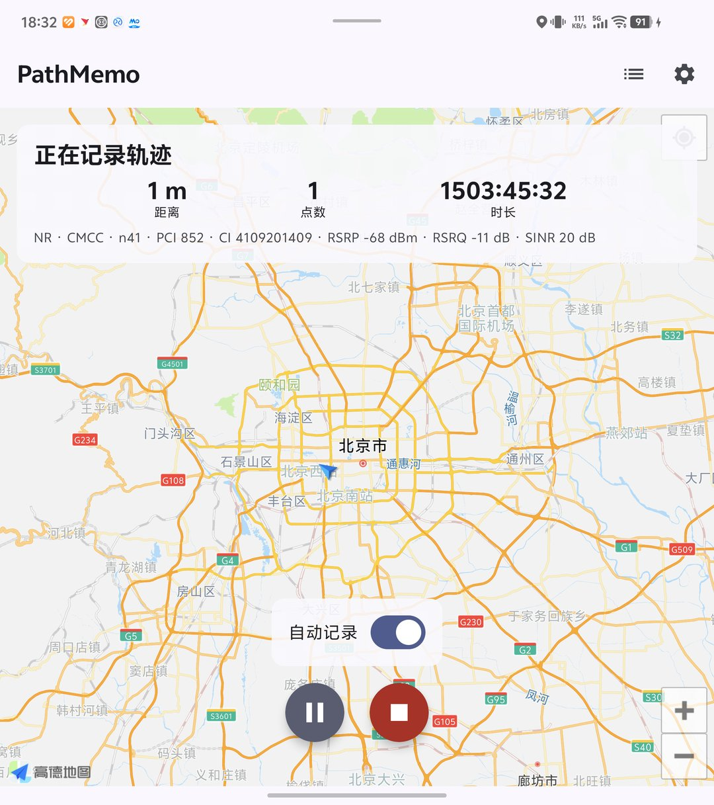
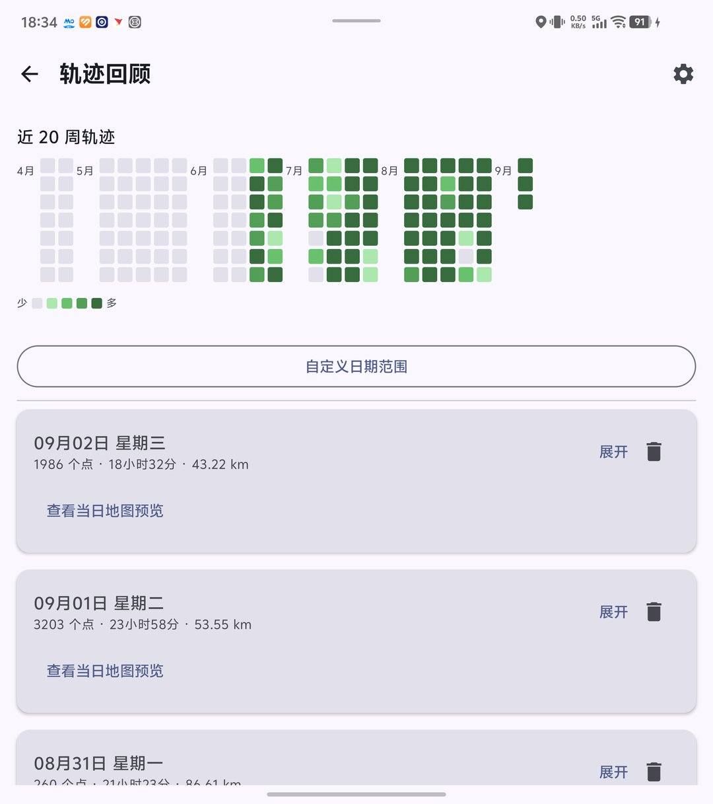
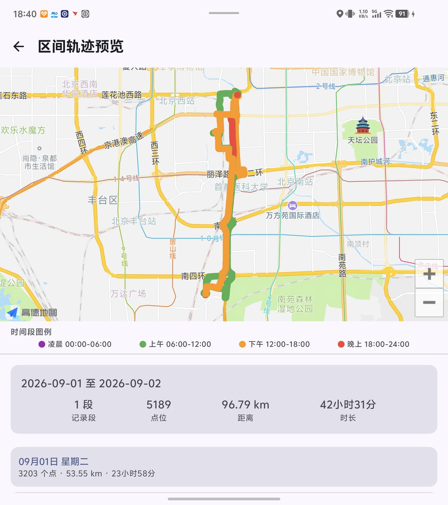
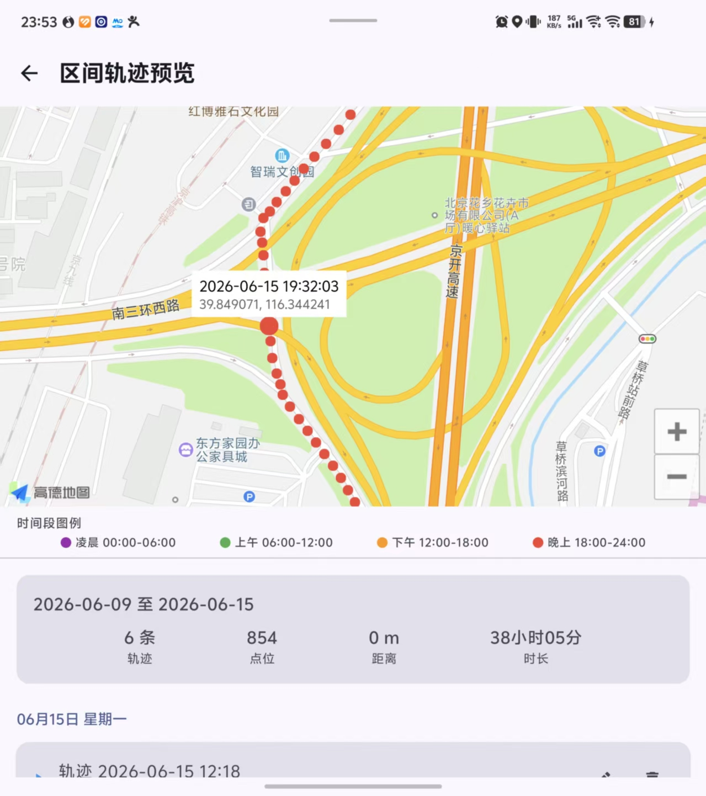

# PathMemo

一款 Android 个人轨迹记录与回溯 APP，支持静默后台记录、高德地图可视化、时间轴回放。

## 功能特性

- **静默记录**：前台 Service + 高德定位 SDK，后台持续采集位置。
- **开机自动记录**：支持设备重启后自动恢复轨迹记录（需在设置中开启并授权位置权限）。
- **地图可视化**：实时显示当前位置与已记录轨迹；历史轨迹详情页绘制完整路径。
- **时间轴回溯**：历史轨迹列表按时间倒序展示，详情页支持滑块定位与多倍速回放。
- **本地存储**：使用 Room 数据库保存轨迹与位置点，数据不上传。
- **隐私合规**：首次运行申请位置权限，提供隐私说明与电池优化白名单引导。

## 效果预览

| 首页 / 正在记录 | 轨迹回顾 |
|---|---|
|  |  |

| 区间轨迹预览 · 整体路径 | 区间轨迹预览 · 点位详情 |
|---|---|
|  |  |

## 技术栈

- Kotlin 1.9.24
- Jetpack Compose
- MVVM + Repository
- Room + KSP
- Koin 依赖注入
- 高德地图 AMap（定位 + 地图）
- Accompanist Permissions

## 项目结构

```
app/src/main/java/com/pathmemo/
├── PathMemoApp.kt              # Application + Koin 初始化
├── data/
│   ├── db/                     # Room DAO 与 Database
│   ├── model/                  # Track / LocationPoint / AppSettings 实体
│   ├── repository/             # TrackRepository
│   └── store/                  # DataStore 设置持久化
├── location/
│   └── LocationRecorder.kt     # AMap 定位封装与位置过滤
├── service/
│   └── LocationRecordService.kt# 前台轨迹记录服务
├── ui/                         # Compose 页面与地图组件
│   ├── map/AmapMap.kt / TrackMapView.kt
│   ├── home/HomeScreen.kt
│   ├── history/HistoryScreen.kt
│   ├── overview/OverviewScreen.kt
│   ├── preview/DayPreviewScreen.kt
│   ├── range/RangePreviewScreen.kt
│   ├── detail/TrackDetailScreen.kt
│   ├── settings/SettingsScreen.kt
│   └── navigation/PathMemoNavHost.kt
├── viewmodel/                  # 各页面对应 ViewModel
└── di/AppModule.kt             # Koin 模块
```

## 运行前配置

1. 前往 [高德开放平台](https://lbs.amap.com) 注册并创建应用，获取 **Key**。
2. 打开项目根目录 `local.properties`，将 `AMAP_API_KEY=YOUR_AMAP_API_KEY` 替换为实际 Key。
3. 使用 Android Studio 或 `./gradlew assembleDebug` 构建安装包。

## 权限说明

APP 需要以下权限：

- `ACCESS_FINE_LOCATION` / `ACCESS_COARSE_LOCATION`：基础定位
- `ACCESS_BACKGROUND_LOCATION`：后台持续记录
- `FOREGROUND_SERVICE` / `FOREGROUND_SERVICE_LOCATION`：前台服务
- `POST_NOTIFICATIONS`：记录通知（Android 13+）
- `RECEIVE_BOOT_COMPLETED`：开机自动恢复记录

## 电脑端查看工具

项目提供 `tools/web_viewer/`，可在电脑上通过浏览器查看手机里的轨迹数据。

1. 手机连接电脑并开启 USB 调试。
2. 网页地图会自动读取项目 `local.properties` 中的 `AMAP_API_KEY`。如果该 Key 仅绑定 Android 平台，需要再创建一个 Web JS API Key 并填入 `local.properties`；如开启了 Key 白名单，需将 `127.0.0.1` / `localhost` 加入 HTTP Referer 白名单。
3. Windows 直接双击项目根目录的 `start_web_viewer.bat`，或右键它发送到桌面快捷方式；也可以运行一次 `create_web_viewer_shortcut.ps1` 在桌面生成图标（如系统限制脚本执行，可在 PowerShell 中先执行 `Set-ExecutionPolicy -ExecutionPolicy Bypass -Scope Process`）。
4. 命令行方式：
   ```bash
   cd tools/web_viewer
   python web_viewer.py
   ```
4. 脚本会自动通过 ADB 拉取 SQLite 数据库，并打开本地网页 `http://127.0.0.1:8765/`。

功能：地图散点展示、按时间段着色、日历热力图、日期范围筛选、轨迹列表、点击点位查看详情。

## 注意事项

- 部分国产系统（小米/华为/OPPO/vivo）会限制后台定位，建议在“设置 → 电池优化白名单”中开启忽略电池优化。
- 轨迹数据仅保存在本地 SQLite，卸载 APP 会丢失，后续可扩展导出 GPX / JSON 功能。
- Web Viewer 通过 ADB 读取应用私有数据库，仅适用于调试版（debug）安装包。
